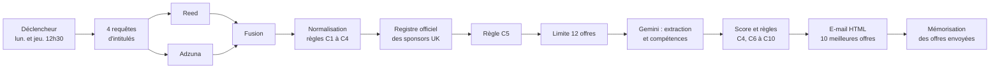

# Veille automatique d'offres Data & IA à Londres (n8n)

Projet réalisé avec **n8n** : un workflow qui surveille chaque semaine les offres d'emploi Data et IA à Londres, ne garde que celles qui correspondent à un profil junior finance/data avec sponsorisation de visa, les note avec une IA (Gemini), et envoie **un seul e-mail de 10 offres** le lundi et le jeudi à 12h30.

> **Statut : projet en cours de test.** Le workflow est construit et validé ; les tests de bout en bout dépendent des quotas des API gratuites (Reed, Adzuna, Gemini).

## Objectif

Automatiser une tâche répétitive : chercher des offres sur plusieurs sites, éliminer les doublons et les offres non pertinentes, puis recevoir un résumé classé. Contraintes retenues : **Londres uniquement**, aucun Google Sheet, un seul e-mail par envoi, offres déjà envoyées jamais renvoyées.

## Fonctionnement



| Bloc | Rôle |
|---|---|
| 1. Requêtes | Génère 4 intitulés : Data Analyst, Financial Data Analyst, AI Solutions Engineer, ML Engineer |
| 2. Collecte | Appelle les API Reed et Adzuna (Londres), puis fusionne les résultats |
| 3. Normalisation | Uniformise les champs, supprime les doublons, applique les règles C1 à C4 |
| 4. Registre sponsors | Télécharge le registre officiel GOV.UK et ne garde que les employeurs autorisés à sponsoriser (règle C5) |
| 5. IA et score | Gemini extrait contrat, expérience, salaire, secteur ; un score déterministe est calculé |
| 6. E-mail | Compose et envoie l'e-mail, puis mémorise les offres traitées |
| 7. Alerte | Un second workflow envoie un e-mail si le premier plante |

## Règles de filtrage

| Règle | Exclut |
|---|---|
| C1 | Offre déjà envoyée ou en double (clé `entreprise|titre|london`) |
| C2 | Offre publiée depuis 14 jours ou plus |
| C3 | Postes Senior, Lead, Head, Principal, Director |
| C4 | Freelance, stage, alternance, contrat à la journée |
| C5 | Employeur absent du registre des sponsors (Skilled Worker, note A) |
| C6 | Trading, banque d'investissement, hedge fund |
| C7 | Contrat de moins de 6 mois |
| C8 | Plus de 3 ans d'expérience exigés |
| C9 | Salaire maximum inférieur à 35 000 GBP par an |
| C10 | Score inférieur à 60, ou adéquation de compétences inférieure à 0,3 |

## Formule de score (sur 100)

`Score = 35 × S_secteur + 30 × S_compétences + 20 × S_salaire + 15 × S_expérience`

- **S_secteur** : 1 (finance éligible ou fintech), 0,7 (startup ou scale-up tech), 0,3 (autre)
- **S_salaire** : `min(1 ; max(0 ; (A − 35 000) / 10 500))`, 0,6 si le salaire n'est pas indiqué
- **S_expérience** : 1 si 2 ans ou moins, 0,7 jusqu'à 3 ans, 0,6 si non précisé
- **S_compétences** : note de 0 à 1 donnée par l'IA (recouvrement entre l'offre et le profil)

Le calcul est fait dans un nœud de code, pas par l'IA : il est reproductible et vérifiable.

## Choix techniques

- **n8n Cloud** pour l'orchestration, nœuds Code (JavaScript) pour la logique métier.
- **Gemini** (Google) pour lire le texte des offres. L'IA extrait des informations, mais ne décide pas seule : les règles d'exclusion et le score sont calculés par du code.
- **Tolérance aux pannes** : nouvelles tentatives sur les appels API, limite de 12 offres analysées par exécution (quota de 15 requêtes par minute), et une offre sans réponse de l'IA est écartée au lieu de bloquer le workflow.
- **Mémoire anti-doublon** : stockée dans les données internes du workflow (purge après 30 jours). Elle ne fonctionne qu'une fois le workflow activé.

## Contenu du dépôt

```
workflows/
  veille-offres-gemini.workflow.ts        Projet principal, version Gemini (18 nœuds)
  veille-offres-openai.workflow.ts        Première version, avec OpenAI
  offres-data-ia.workflow.ts              Version de travail regroupant veille et alerte
  alerte-erreur.workflow.ts               Alerte e-mail quand le workflow principal plante
  recommandation-voyage-we.workflow.ts    Projet : recommandation de destination pour le week-end
  demo-eugenia.workflow.ts                Premier exercice : météo de Paris par e-mail
  test-bonjour.workflow.ts                Petit workflow de test
.env.example                              Modèle des clés à renseigner (aucune clé réelle)
```

Les fichiers `.workflow.ts` sont au format du CLI [`n8ncli`](https://www.npmjs.com/package/@workflows-accelerator/n8n-cli) (commande `n8ncli`), qui permet de gérer des workflows n8n comme du code. Les clés, adresses e-mail, identifiants de credentials et le profil personnel ont été **retirés** (remplacés par `TODO` ou des valeurs neutres).

## Autres workflows du dossier

| Workflow | Description |
|---|---|
| **Recommandation voyage WE** | Chaque vendredi à 9h : récupère la météo (API Open-Meteo) et les taux de change, écarte les villes pluvieuses, calcule un score et convertit la monnaie, garde le top 3, puis fait rédiger une recommandation par une IA et l'envoie par message. |
| **Demo Eugenia First Workflow** | Premier exercice : tous les jours à 7h, récupère la météo de Paris (API Open-Meteo) et l'envoie par e-mail. |
| **Test Bonjour** | Workflow minimal (déclencheur manuel puis un message) pour vérifier la chaîne de publication. |
| **Veille offres, version OpenAI et « Offres Data et IA »** | Versions successives du projet principal, avant le passage à Gemini. |

## Installation

1. Créer un compte n8n Cloud (ou lancer n8n avec Docker).
2. Importer ou publier les workflows du dossier `workflows/`.
3. Créer les credentials dans n8n : **Reed** (Basic Auth), **Google Gemini(PaLM) API**, **Gmail**.
4. Renseigner `app_id` et `app_key` Adzuna dans le nœud « 04 Collecter – Adzuna », l'adresse destinataire dans le nœud « 17 Envoyer – E-mail », et son propre profil dans le nœud « 12 Préparer – Requête IA ».
5. Exécuter à la main plusieurs fois avant d'activer le workflow.

## Sécurité et confidentialité

- Aucune clé API n'est stockée dans ce dépôt. Le fichier `.env` est exclu par `.gitignore`.
- Le profil du candidat est un texte à fournir soi-même dans le nœud 12 ; il est envoyé à l'API Gemini à chaque analyse d'offre.

## Difficultés rencontrées

- Quotas des API gratuites : erreurs 429 (trop de requêtes) et 503 (modèle surchargé), résolues par une limite d'offres et des nouvelles tentatives.
- Modèles Gemini retirés ou renommés : le nom du modèle doit être vérifié régulièrement.
- Le nœud qui télécharge le registre des sponsors devait s'exécuter une seule fois (et non une fois par offre).

## Outils et transparence

Ce projet a été construit avec l'aide de **Claude Code** (assistant IA d'Anthropic) pour générer et valider les workflows, à partir d'un cahier des charges défini par l'auteure. Les tests, les réglages dans n8n et la configuration des comptes ont été faits par l'auteure.

## Auteure

Natalia Medrano Sow
