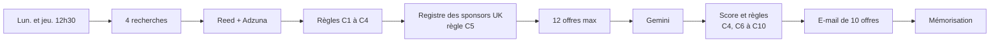

# Veille d'offres Data & IA à Londres (n8n)

Un workflow **n8n** qui cherche des offres Data et IA à Londres (Reed et Adzuna), garde celles qui correspondent à un profil junior finance/data **avec sponsorisation de visa**, les note avec Gemini, et envoie **un e-mail de 10 offres** le lundi et le jeudi à 12h30.

Le dépôt contient aussi **3 skills Claude Code** (`.claude/skills/`) et leur application à ce projet.

## Organisation du dépôt

```
README.md
.claude/
  skills/
    interview-and-represent/        10 %   interroger puis re-présenter le besoin
    hostile-review/                 10 %   relecture hostile
    doubt-driven-development/       80 %   développer en doutant, puis en prouvant
workflows-ts/
  n8n-workflows/                    workflows n8n en TypeScript (format n8ncli)
    projects/   veille d'offres Data & IA (projet principal)
    sandbox/    alerte d'erreur, exercices (voyage du week-end, météo)
    templates/  modèle n8n d'apprentissage (non écrit par moi)
    utils/      workflow de test
veille-offres-londres/
  code/         code JavaScript des 8 nœuds « Code », lisible
  tests/        tests automatiques
docs/           explications des skills et application au projet
.env.example    modèle des clés (aucune clé réelle)
```

**Par où commencer :** [`docs/EXPLICATIONS-SKILLS.md`](docs/EXPLICATIONS-SKILLS.md) (les skills), puis [`docs/APPLICATION-VEILLE-OFFRES.md`](docs/APPLICATION-VEILLE-OFFRES.md) (les skills appliqués au projet).

## Fonctionnement



| Étape | Code |
|---|---|
| Règles C1 à C4 : doublons, date, seniors, contrats | [`06`](veille-offres-londres/code/06-normaliser-regles.js) |
| Registre officiel des sponsors (C5) | [`08`](veille-offres-londres/code/08-extraire-lien-csv.js), [`10`](veille-offres-londres/code/10-appliquer-sponsors.js) |
| Requête à Gemini et score sur 100 | [`12`](veille-offres-londres/code/12-preparer-requete-ia.js), [`14`](veille-offres-londres/code/14-scorer.js) |
| E-mail et mémoire anti-doublon | [`16`](veille-offres-londres/code/16-composer-email.js), [`18`](veille-offres-londres/code/18-memoriser.js) |

**Règles d'exclusion.** C1 doublon · C2 plus de 14 jours · C3 poste senior · C4 contrat freelance, stage, jour · C5 employeur absent du registre des sponsors · C6 trading et banque d'investissement · C7 contrat de moins de 6 mois · C8 plus de 3 ans d'expérience · C9 salaire sous 35 000 £ · C10 score sous 50 ou compétences sous 0,3.

**Score.** `35 × secteur + 30 × compétences + 20 × salaire + 15 × expérience`, calculé par du code (l'IA extrait seulement les informations).

## Résultats sur données réelles

Nœuds 06, 10, 12 et 14 rejoués sur les offres Reed et Adzuna du jour, le registre officiel (143 136 lignes) et 12 appels réels à Gemini :

| Étape | Offres |
|---|---|
| Collecte Reed + Adzuna (sans doublons) | 339 |
| Après C1 à C4 | 146 |
| Après le registre des sponsors (C5) | 48 |
| Analysées par Gemini (12 premières), retenues | 4 |

Défauts trouvés et corrigés : salaires mensuels lus comme annuels, seuil de score trop dur, contrat temporaire pris pour un freelance, noms de sponsors, double e-mail. Détail dans [`docs/APPLICATION-VEILLE-OFFRES.md`](docs/APPLICATION-VEILLE-OFFRES.md).

## Lancer les tests

Il faut seulement [Node.js](https://nodejs.org), aucune clé.

```bash
node veille-offres-londres/tests/run-all.js
```

## Mettre en place le workflow

1. Sur n8n, créer les credentials : **Reed** (Basic Auth), **Google Gemini(PaLM) API**, **Gmail**.
2. Publier les fichiers de `workflows-ts/n8n-workflows/` avec le CLI [`n8ncli`](https://www.npmjs.com/package/@workflows-accelerator/n8n-cli).
3. Renseigner `app_id` et `app_key` Adzuna (nœud 04), l'adresse destinataire (nœud 17) et son propre profil (nœud 12).
4. Exécuter à la main plusieurs fois avant d'activer (la mémoire anti-doublon ne marche qu'une fois le workflow activé).

## Sécurité et limites

- Aucune clé dans ce dépôt (`.env` exclu). Les workflows exportés sont nettoyés (clés, jetons, e-mails, profil).
- Le profil du candidat est envoyé à Gemini à chaque analyse.
- Quota gratuit de Gemini : 15 requêtes par minute, d'où la limite de 12 offres par exécution.
- Rendement modeste : la plupart des offres Data à Londres sont dans le secteur « autre », peu valorisé par le score.

## Outils et transparence

Projet construit avec l'aide de **Claude Code** (assistant IA d'Anthropic), à partir d'un cahier des charges défini par l'auteure. Les réglages dans n8n, les comptes et les essais ont été faits par l'auteure.

**Auteure :** Natalia Medrano Sow
