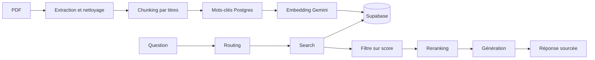

# Natalia · n8n, RAG et skills

Dépôt de mes workflows n8n, de mes scripts Supabase et des skills Claude Code que j'utilise pour les construire.

## Organisation

```
projects/     mes trois projets
  offres-londres-v2/   veille d'offres Data & IA à Londres (Reed, Adzuna, Gemini, e-mail)
  rag-ingestion/       RAG · du PDF à la base vectorielle (Supabase)
  rag-answering/       RAG · de la question à la réponse sourcée
templates/    deux modèles n8n qui m'ont servi de base
sandbox/      vide : brouillons et essais
utils/        tout le reste, utile aux projets
  sql/        scripts Supabase (table, mots-clés Postgres)
  specs/      textes pour les sticky notes (ingestion, answering)
  docs/       explications des skills
.claude/skills/   les skills Claude Code (voir utils/docs/EXPLICATIONS-SKILLS.md)
.agents/skills/   le skill n8n fourni par n8ncli
```

## Les trois projets

### RAG · ingestion et answering

Un chatbot qui répond sur un livre (Père riche, père pauvre) uniquement avec ses extraits.



- Ingestion : [`projects/rag-ingestion`](projects/rag-ingestion)
- Answering : [`projects/rag-answering`](projects/rag-answering)
- Base de données : [`utils/sql/supabase.sql`](utils/sql/supabase.sql)
- Description détaillée (sticky notes) : [`utils/specs`](utils/specs)

### Veille d'offres à Londres

Cherche des offres Data et IA (Reed et Adzuna), garde celles qui ont une sponsorisation de visa, les note avec Gemini et envoie un e-mail de 10 offres le lundi et le jeudi à 12 h 30. Code des nœuds et tests automatiques dans [`projects/offres-londres-v2`](projects/offres-londres-v2).

Tests : `node projects/offres-londres-v2/tests/run-all.js`.

## Utiliser les workflows

Chaque projet a un fichier `.workflow.ts` (format `n8ncli`) et, pour le RAG, un `.import.json` à importer directement dans n8n (nouveau workflow, `⋯`, **Import from file**). Aucune clé n'est dans le dépôt : il faut brancher ses propres credentials. Le modèle des variables est dans `.env.example`.

## Les skills

Cinq skills dans `.claude/skills/` : `interview`, `n8n-bonnes-pratiques`, `n8n-rag`, `doubt-driven-development` et `hostile-review`. Ils choisissent notamment les modèles d'IA **au meilleur prix, d'après des recherches en ligne datées**. Explications dans [`utils/docs/EXPLICATIONS-SKILLS.md`](utils/docs/EXPLICATIONS-SKILLS.md).
