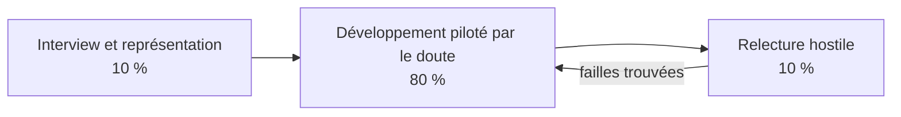

# Explications écrites : les 3 skills

## 1. Qu'est-ce qu'un skill ?

Un **skill** est un mode d'emploi que l'on donne à un assistant IA (ici Claude Code) pour une tâche précise. Techniquement, c'est un dossier contenant un fichier `SKILL.md` :

```
.claude/skills/<nom-du-skill>/SKILL.md
```

Le fichier comporte deux parties :

- **L'en-tête** (entre deux lignes `---`) : le `name` et la `description`. L'assistant lit la description pour décider **quand** activer le skill.
- **Le corps** : les instructions à suivre, étape par étape.

Placés dans le dossier `.claude/skills/` d'un dépôt, les skills sont disponibles pour toute personne qui ouvre ce dépôt avec Claude Code. On peut aussi les lancer à la main avec `/<nom-du-skill>`.

## 2. Les trois skills et leur poids

| Skill | Poids | Rôle en une phrase |
|---|---|---|
| `interview-and-represent` | 10 % | Interroger l'utilisateur, puis lui re-présenter ce qui a été compris pour validation. |
| `hostile-review` | 10 % | Relire un livrable comme un relecteur hostile, qui cherche ce qui casse. |
| `doubt-driven-development` | 80 % | Développer en contestant chaque décision par un doute, puis en le vérifiant par une preuve. |

Le poids indique l'importance de chaque skill dans le travail. Le skill principal est `doubt-driven-development`, qui est aussi le plus détaillé.

> **Interprétation.** Les noms de ces skills ne sont pas des termes standards. J'ai retenu les définitions ci-dessous. Si l'énoncé du cours en donne d'autres (par exemple pour « represente »), il suffit d'adapter les fichiers `SKILL.md`.

## 3. Comment les trois s'enchaînent



1. **Avant** : on interroge l'utilisateur pour fixer le besoin (skill 1).
2. **Pendant** : on construit en doutant de chaque étape et en prouvant (skill 2).
3. **À la fin** : un regard extérieur hostile vérifie le résultat (skill 3). S'il trouve des failles, on retourne au développement.

## 4. Skill 1 : Interview et représentation (10 %)

**Idée.** Beaucoup d'erreurs viennent d'une demande mal comprise. Ce skill impose deux temps : d'abord poser des questions (une à la fois), puis **re-présenter** le besoin sous forme d'une fiche courte, que l'utilisateur confirme ou corrige.

**Points clés.**
- Une question à la fois, environ 6 à 10 au total.
- Ne pas demander ce qui est déjà dans les fichiers ou le contexte.
- Séparer ce que l'utilisateur a **dit** de ce que l'assistant a **supposé**.
- Ne pas commencer le travail avant la validation de la fiche.

**Sortie.** Une « fiche de compréhension » : objectif, livrable, critères de réussite, contraintes, hors périmètre, suppositions à confirmer, questions ouvertes.

## 5. Skill 2 : Développement piloté par le doute (80 %)

**Idée.** Une affirmation non vérifiée est une hypothèse, pas un fait. Pour chaque étape significative, on suit un cycle en 5 temps :

1. **Affirmer** : écrire ce que l'on croit vrai.
2. **Douter** : lister des doutes concrets (« si X alors Y ») par famille : entrées, cas limites, dépendances externes, environnement, sécurité, échec silencieux.
3. **Vérifier** : chercher une preuve peu coûteuse (mini-test, données simulées, documentation, requête en lecture seule).
4. **Trancher** : corriger, garder (en disant pourquoi), ou documenter le risque restant.
5. **Journaliser** : consigner le tout dans un tableau (le *journal des doutes*).

**Règles importantes.**
- Trois statuts seulement : **Vérifié** (preuve citée), **Supposé**, **Inconnu**.
- Un doute sans preuve n'est pas levé.
- On commence par le doute le plus risqué, et on s'arrête quand les doutes restants sont faibles et documentés.
- On ne teste jamais un doute par une action irréversible ou coûteuse sans accord.

**Pourquoi 80 %.** C'est le cœur de la démarche : c'est lui qui transforme un projet « qui a l'air de marcher » en projet dont on sait pourquoi il marche, et où il peut casser.

## 6. Skill 3 : Relecture hostile (10 %)

**Idée.** L'auteur d'un travail voit mal ses propres défauts. Le relecteur hostile cherche activement à le faire échouer, mais reste **honnête** : chaque faille doit avoir un scénario concret et une preuve, sinon elle est marquée « soupçon ».

**Points clés.**
- Aucun compliment, on va droit aux problèmes.
- Angles d'attaque : correction, robustesse, échecs silencieux, sécurité et confidentialité, hypothèses cachées, maintenabilité, écart avec l'objectif.
- Failles classées : **Bloquante**, **Majeure**, **Mineure**.
- Verdict final : à livrer, à livrer après correction, ou à refaire.

## 7. Comment les utiliser

Dans Claude Code, après avoir ouvert ce dépôt :

- taper `/interview-and-represent`, `/doubt-driven-development` ou `/hostile-review` ;
- ou décrire simplement la tâche : Claude choisit le skill grâce à sa `description`.

## 8. Skills généraux, application au projet

Les trois skills sont volontairement **généraux** : ils ne parlent pas de la veille d'offres et peuvent servir à n'importe quel projet de code. Le lien avec le projet est fait à part, dans [`APPLICATION-VEILLE-OFFRES.md`](APPLICATION-VEILLE-OFFRES.md), qui montre chaque skill utilisé sur la veille d'offres à Londres.

Cette séparation permet de réutiliser les skills ailleurs sans les modifier, et de montrer clairement ce qui relève de la méthode et ce qui relève de l'exemple.

